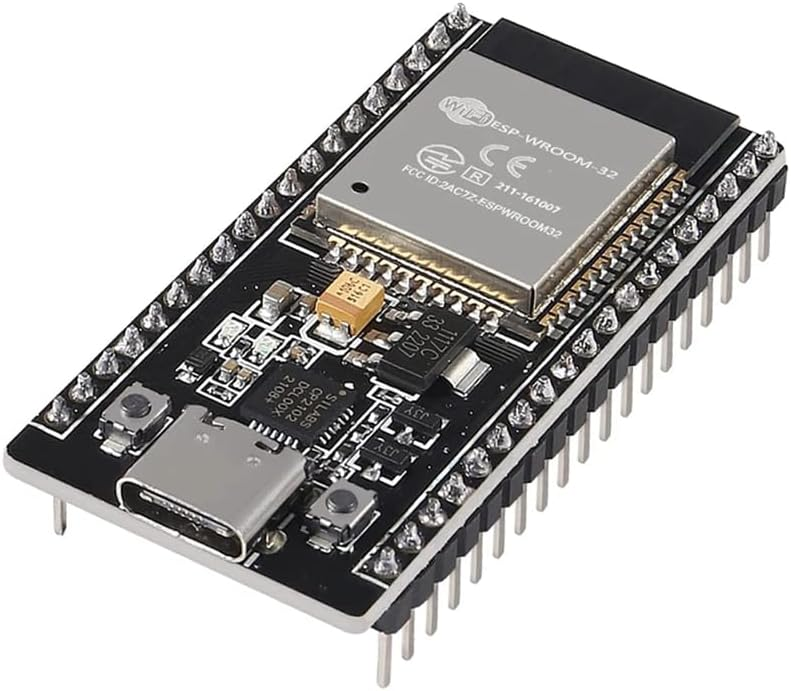
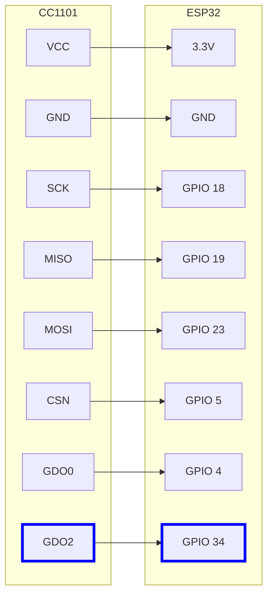

The used hardware was a [ESP-WROOM-32 development board](https://www.amazon.fr/dp/B0CNYM28CK).

Here is the hardware connection :
*(The blue GDO2 is not used in this project)*

```mermaid
graph LR
    subgraph ESP32
        3V3[3.3V]
        GND[GND]
        P18[GPIO 18]
        P19[GPIO 19]
        P23[GPIO 23]
        P5[GPIO 5]
        P4[GPIO 4]
        P34[GPIO 34]
    end

    subgraph CC1101
        VCC_RF[VCC]
        GND_RF[GND]
        SCK_RF[SCK]
        MISO_RF[MISO]
        MOSI_RF[MOSI]
        CSN_RF[CSN]
        GDO0_RF[GDO0]
        GDO2_RF[GDO2]
    end

    VCC_RF --> 3V3
    GND_RF --> GND
    SCK_RF --> P18
    MISO_RF --> P19
    MOSI_RF --> P23
    CSN_RF --> P5
    GDO0_RF --> P4
    GDO2_RF --> P34
    %% Blue GDO2
    style GDO2_RF stroke:#00f,stroke-width:4px
    style P34 stroke:#00f,stroke-width:4px
```