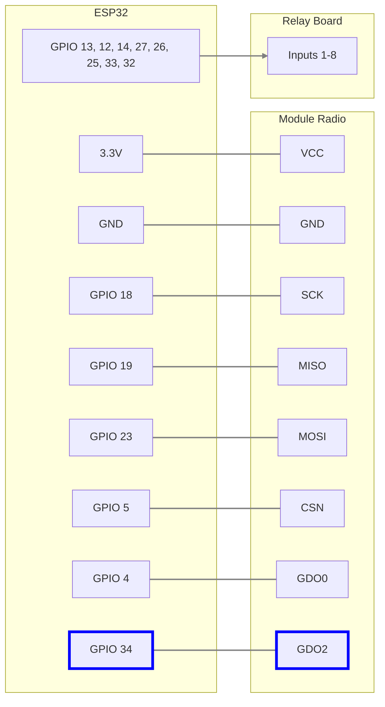

The used hardware was a [ESP32 8 Relays board](https://www.amazon.fr/dp/B0CZDQ9QRG).

Here is the hardware connection :
*(The blue GDO2 is not used in this project)*

```mermaid
graph LR
    %% Styles
    linkStyle default stroke-width:2px,fill:none,stroke:gray;

    subgraph RF_GROUP [Module Radio]
        direction TB
        CC_VCC[VCC]
        CC_GND[GND]
        CC_SCK[SCK]
        CC_MISO[MISO]
        CC_MOSI[MOSI]
        CC_CSN[CSN]
        CC_GDO0[GDO0]
        CC_GDO2[GDO2]
    end

    subgraph ESP_GROUP [ESP32]
        direction TB
        %% Pins SPI
        E_3V3[3.3V]
        E_GND[GND]
        E_18[GPIO 18]
        E_19[GPIO 19]
        E_23[GPIO 23]
        E_5[GPIO 5]
        E_4[GPIO 4]
        E_34[GPIO 34]
        
        %% Pins Relais (Groupés pour gagner de la place)
        E_RELAYS[GPIO 13, 12, 14, 27, 26, 25, 33, 32]
    end

    subgraph RELAY_GROUP [Relay Board]
        R_IN[Inputs 1-8]
    end

    %% Wiring RF
    E_3V3 --- CC_VCC
    E_GND --- CC_GND
    E_18 --- CC_SCK
    E_19 --- CC_MISO
    E_23 --- CC_MOSI
    E_5 --- CC_CSN
    E_4 --- CC_GDO0
    E_34 --- CC_GDO2
    
    %% Wiring Relais
    E_RELAYS ==> R_IN

    %% Couleurs pour la lisibilité
    style CC_GDO2 stroke:#00f,stroke-width:4px
    style E_34 stroke:#00f,stroke-width:4px
```